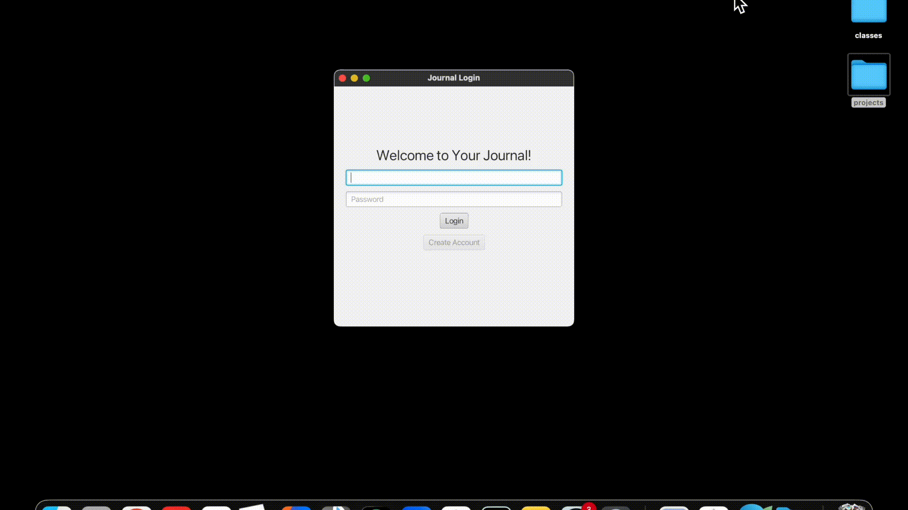

# Journaling Desktop App

A personal journaling application built in Java with SQL-based persistent storage and bcrypt-hashed passwords,enabling secure and safe management of journal entries.
---

## 🎥 Demo

## ✨ Features
- User authentication
- Secure password storage
- Persistent storage of reflections
- Easy-to-use GUI interface

## 🛠️ Tech Stack
**Language:** Java

**Persistence:** SQLite (via JDBC)

**Security:** bcrypt for password hashing

## 🔮 Future Improvements
- Support for multiple user accounts
- Searching for entries
- Exporting and importing reflections for backup

Note: App is designed to run locally on the developer’s machine.
